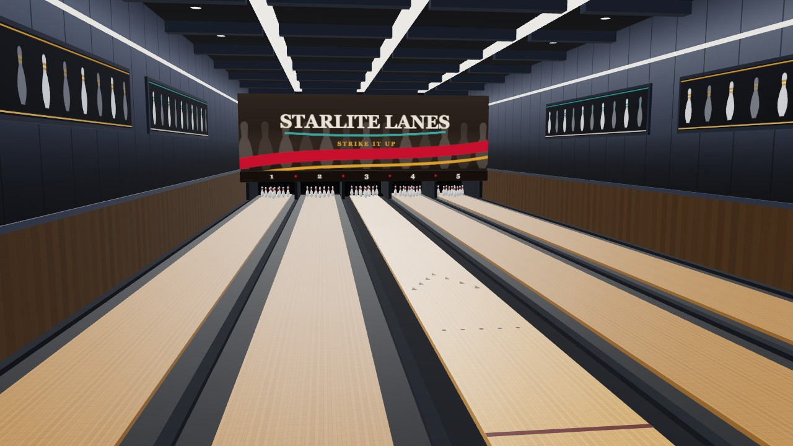
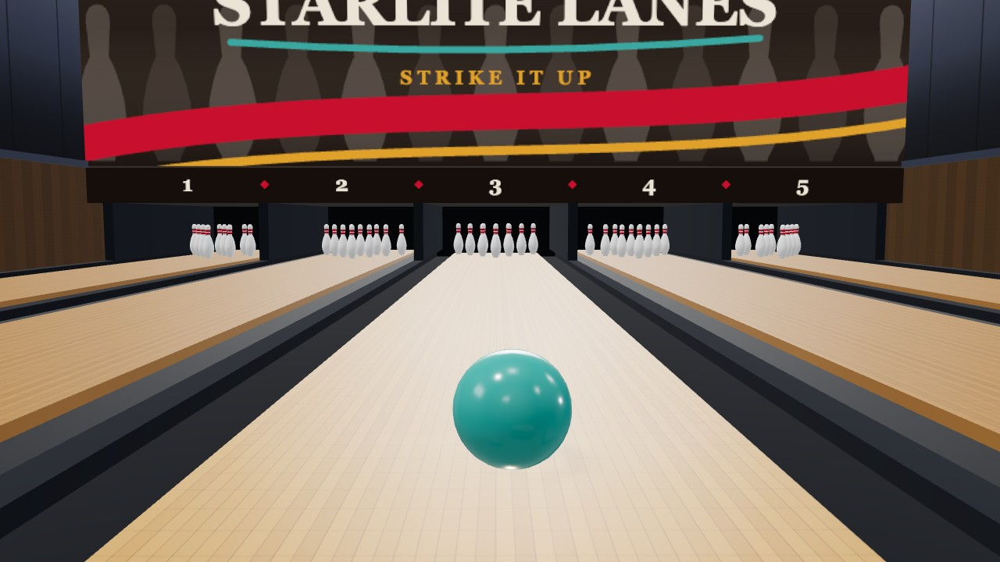
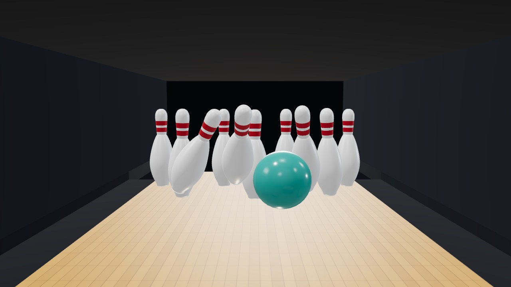

# STARLITE LANES

브라우저에서 돌아가는 3D 볼링 게임. Three.js 렌더 + Rapier(Rust→WASM) 물리 위에서
정식 10프레임 룰과 슬립 기반 훅을 굴린다.

**▶ [바로 플레이 — bowling-3d.vercel.app](https://bowling-3d.vercel.app/)** (설치 없음 · 데스크톱/모바일)



미드센추리 볼링 하우스를 **에셋 없이 코드로만** 지었다 — 레인·핀·마스킹 유닛·옆벽 그래픽 밴드·
UI가 전부 절차적이고, 배경 4개 레인은 장식이 아니라 **실제로 물리가 도는** 레인이다.
**풀게임(10프레임) / 블리츠(3프레임) / 스페어 챌린지** 세 모드와 **AI 라이벌 3인**(초보·중수·고수)
대결이 있고, 업적 6종을 달성하면 코스메틱 볼 스킨 7종이 해금된다(외형 전용 — 물리·AI 사다리에
무영향, 과금·가챠 없음). 한국어/영어/일본어/중국어 4개 언어.

<table>
<tr>
<td width="50%"></td>
<td width="50%"></td>
</tr>
<tr>
<td>오일 구간을 미끄러지는 공. 뒤쪽 4개 레인도 물리가 돌고 있다.</td>
<td>1-3 포켓 진입 순간. 캐리는 물리가 정한다.</td>
</tr>
</table>

## 기술 스택

| 역할 | 선택 |
|---|---|
| 3D 렌더링 | [Three.js](https://threejs.org/) |
| 물리 | [Rapier](https://rapier.rs/) (`@dimforge/rapier3d-compat`, Rust→WASM) |
| 빌드/테스트 | Vite + Vitest |
| 언어 | TypeScript (`strict`, `any` 0개) |

외부 에셋은 사운드 파일 셋뿐이다 — `roll.wav`(383KB) · `strike.wav`(388KB) · BGM(1.5MB).
나머지 소리(핀세터 기계음·피트 쿠션·볼 리턴 사슬·UI 틱·PA 차임)는 전부 WebAudio 합성이고,
도형·텍스처·UI도 전부 코드 생성이다. 소리 13종의 설계·실측은 [docs/SOUND.md](docs/SOUND.md).

## 실행

```bash
npm install
npm run dev      # 개발 서버 http://localhost:5173
npx vitest run   # 테스트 1회 실행
npm run build    # 프로덕션 번들 (tsc 타입체크 + vite build → dist/)
```

## 데스크톱 · 모바일 앱

같은 코드를 [Tauri v2](https://v2.tauri.app)로 **Windows · macOS · Android · iOS** 네이티브 앱으로 패키징한다(셸은 `src-tauri/`).

```bash
npm run app:dev      # 데스크톱 개발 창
npm run app:build    # 데스크톱 번들 (현재 OS)
npm run ios:dev      # iOS (Mac + Xcode)
npm run android:dev  # Android (SDK/NDK 필요)
```

빌드된 설치본은 main 푸시마다 CI가 만들어 **[Releases](https://github.com/Electornic/bowling-3d/releases)**
에 올린다 — Android `.apk` · Windows `.msi`/`.exe` · macOS `.zip`(안에 `.app`, Intel·Apple Silicon 유니버설).
코드 서명은 없어서 첫 실행에 SmartScreen·Gatekeeper 경고가 뜬다(우회법은 릴리스 노트에 적혀 있다).
설치가 번거로우면 [웹](https://bowling-3d.vercel.app/)이 같은 빌드다.

준비물·스토어·플랫폼별 주의는 [docs/APP_PACKAGING.md](docs/APP_PACKAGING.md) 참고.

## 조작

**데스크톱 (마우스 + 키보드)**
- **마우스 이동** — 조준 (공 앞 짧은 방향 가이드 표시 — 훅 결과는 안 보여줌)
- **마우스 꾹 눌렀다 떼기** — 파워 차징 → 발사
- **마우스 휠 또는 좌하단 스핀 바 드래그** — 좌/우 스핀 (조준선 색이 방향·세기를 함께 보여준다)
- **Esc** — 일시정지 (설정·볼 무게·컬렉션·포기)

**모바일 (터치)**
- **누른 채 좌우 드래그** — 조준(상대 드래그) + 동시에 파워 차징, 떼면 발사
- **좌하단 스핀 바 드래그** — 좌/우 스핀
- **세로 화면이 주력**이다. 볼링 레인은 좁고 깊어서 가로로 들면 모든 게 2.2배 작아진다(iPhone 15 실측: 공 지점 레인 폭이 화면 가로의 7.8%). 가로로 돌리면 세로로 돌려달라는 안내가 뜬다.
- 더블탭/핀치 줌·당겨서새로고침 차단, safe-area·저사양 품질 적응 적용

모드·상대·볼 무게(6~16 lb)는 **시작 메뉴**에서 고른다. 무게는 일시정지 모달에서도 바꿀 수 있다(다음 투구부터 적용).

## 물리 구현 하이라이트

- **스키드 → 훅 → 롤 3단계 궤적**: 볼링공이 휘는 건 마그누스가 아니라 지면 동마찰. 슬립 기반 측면력을 매 스텝 `applyImpulse(F·dt)`로 주입하고, 오일 존(앞 11.9m = 39ft 하우스 샷)과 드라이 존의 마찰 차등으로 실제 볼링처럼 막판에 꺾인다. 오일은 프레임이 끝날 때마다 조금씩 마르고(최대 1.5m), 그만큼 브레이크 지점이 앞당겨진다.
- **마찰 결합 규칙 트릭**: 레인은 `Min` 결합(오일 시뮬), 핀은 `Max` 결합(항상 접지) — Rapier의 규칙 우선순위(Max > Min > Average)로 바닥 콜라이더 하나를 공유하면서 접촉 쌍별 마찰 정책을 분리.
- **Ghost collision 회피**: 바닥을 구간별 콜라이더로 분할하면 이음새에서 공이 튄다(엔진 공통 함정). 전장 단일 콜라이더 + 공 위치 기준 동적 `setFriction`으로 해결.
- **규격 거터를 콜리전 그룹으로**: 규격 깊이 거터(1.875in)는 얕아서 홈에 앉은 공이 코너 핀에 11.6mm 파고든다. Rapier엔 오목 프리미티브가 없어 곡면 채널을 만들 수 없다 — 그래서 형상 대신 **거터에 들어간 공의 콜리전 그룹에서 핀 비트를 뺀다**. USBC도 "공이 레인을 벗어나면 그 투구의 핀폴은 무효"이므로 규칙 그대로다(실측: 무효 핀폴 113핀 → 0핀).
- **점수는 순수함수**: 누적 점수를 저장하지 않고 flat한 투구 배열에서 매번 재계산 → 스트라이크/스페어 보너스 룩어헤드가 단순해진다.
- **시간축이 둘**: 고정 timestep(1/60) accumulator + 렌더 프레임 분리 + 보간 + CCD. 슬로모·AI 빨리감기는 accumulator **유입 시간만** 스케일하고 물리 dt는 절대 건드리지 않는다 — 결정성과 궤적 검증을 지키기 위해서다.
- **핀 임팩트는 투구당 한 번**만 울린다. 개별 contact마다 소리를 내면 슬로모 구간에서 '탭탭탭'으로 들려서, 핀이 실제로 움직이기 시작한 순간을 한 사건으로 잡는다.

## 테스트 · 측정

물리·연출 값을 **눈으로 A/B 하지 않는 것**이 이 리포의 작업 규칙이다. 전체 스위트는
`npx vitest run` — **19개 파일 151 passed / 7 skipped, 0.6초**.

| 층 | 지키는 것 |
|---|---|
| `tests/unit/` | 순수함수 — 점수·스플릿·보상·이징. 의존성 0 |
| `tests/scenarios/` | 사용자 시나리오 E2E — 가짜 씬 위에서 `throwBall → ROLLING → SETTLING → score → gameOver`를 끝까지 |
| `tests/sim/` | 실물리 측정(Rapier) — 볼 모션 척도·AI 점수 분포·거터볼 행선지. env 게이트라 기본 skip |
| `tests/geometry/` | 씬 상수 커플링 회귀 — 카메라 시선이 핀을 자르는지, 핀덱 레이아웃 |

- **가짜 씬이 거짓말을 못 한다.** `tests/helpers/fakeScene.ts`의 스텁이 `Pick<진짜클래스, …>`로
  묶여 있어서, 협력자 API가 바뀌면 `npm run build`(tsc)가 깨진다.
- **sim 헬퍼는 `constants.ts`를 import**한다 — 게임과 값이 1:1이라 "테스트만 통과하는 물리"가 안 생긴다.
- **상수는 근거를 들고 다닌다.** 예: 핀 베이 개구부 높이 `PIN_BAY_TOP = 0.6`은 24구·82,278 핀프레임
  실측(핀 꼭대기 최대 0.518, 0.55 초과 0건)에서 나온 값이고, 그 근거가 주석에 그대로 붙어 있다.

```bash
BALL_SIM=1  npx vitest run tests/sim/ball-motion-sim.test.ts   --reporter=verbose  # 궤적 척도 vs 실볼링
AI_CAL=1    npx vitest run tests/sim/ai-calibrate.test.ts      --reporter=verbose  # AI 포켓·훅 드리프트 스캔
AI_SIM=1    npx vitest run tests/sim/ai-match-sim.test.ts      --reporter=verbose  # AI 사다리 점수 분포
GUTTER_SIM=1 npx vitest run tests/sim/gutter-return-sim.test.ts --reporter=verbose # 거터볼 행선지
```

## 문서

- [docs/GAME_DESIGN.md](docs/GAME_DESIGN.md) — 설계 도안 (좌표계·물리 상수·상태머신·Rapier API 검증 부록)
- [docs/SOUND.md](docs/SOUND.md) — 사운드 13종의 신호 경로·합성 파라미터·게인 실측
- [docs/MOBILE_SUPPORT.md](docs/MOBILE_SUPPORT.md) — 모바일/터치 대응 (발사 인터랙션·반응형 UI·뷰포트/제스처·성능 적응)
- [docs/APP_PACKAGING.md](docs/APP_PACKAGING.md) — Tauri v2 패키징 (Win·Mac·Android·iOS 빌드·스토어·함정)

⚠️ 사운드는 도안 §10과 구현이 여러 군데 갈렸다(howler.js·contact force 방식 등 미채택).
§10은 *설계 의도*이니 사운드는 `SOUND.md`를 먼저 볼 것.

### 지난 설계 기록 (`docs/legacy/`)

기능이 실제로 어떻게 굴러가는지는 **코드와 커밋 메시지가 단일 소스**다. 아래는 그때의 근거·측정·
대안 검토가 남아 있는 기록이라, "왜 이 값인가"를 물을 때만 열면 된다. **현재 상태의 서술로는
믿지 말 것** — 특히 `PROGRESS.md`는 2026-07-13에서 멈춰 있다.

- [REWARDS.md](docs/legacy/REWARDS.md) — 보상 시스템 설계 (업적 뱃지 + 코스메틱 볼 스킨·컬렉션)
- [SPIN_FEEL_AND_AI_LADDER.md](docs/legacy/SPIN_FEEL_AND_AI_LADDER.md) — 스핀 손맛 + AI 난이도 사다리 튜닝
- [OIL_META_AND_AUTO.md](docs/legacy/OIL_META_AND_AUTO.md) — 오일 패턴 메타 & 오토 튜닝 설계 노트
- [UI_REVAMP.md](docs/legacy/UI_REVAMP.md) — 인게임 UI 개편 설계 (구 네온 글래스 토큰 — 2026-09-02에 미드센추리 인쇄 팔레트로 교체됨)
- [POLISH_BACKLOG.md](docs/legacy/POLISH_BACKLOG.md) — 마감 백로그 (미착수 항목 번호가 코드 주석에서 참조됨)
- [GAMEPLAY_ROADMAP.md](docs/legacy/GAMEPLAY_ROADMAP.md) — 게임성 로드맵·브레인스토밍 기록
- [PROGRESS.md](docs/legacy/PROGRESS.md) — 세션별 진행 기록 (⚠️ 2026-07-13 이후 갱신 없음)

## 디버그

브라우저 콘솔에 전역 노출:

```
__game  __ball  __pins  __engine  __environment  __cameraRig
__sound  __controls  __stillCut  __replay
```

보상 디버그(호출 후 새로고침): `__unlockAllRewards()` — 업적/스킨 전체 해금 · `__resetRewards()` — 진행 초기화 ·
`__previewScreenUnlock()` — 결과 화면 해금 박스 미리보기.

```js
// 수동 물리 스텝 (숨은 탭에선 rAF가 아예 안 돈다 — visibilitychange가 루프를 멈춘다)
__game.throwBall(0, 1, 0);
for (let i = 0; i < 600; i++) { __engine.step(1/60); __game.update(1/60); __engine.sync(1); }
```

⚠️ `__engine.step()`에 **dt를 빼면 안 된다.** 생략하면 `world.timestep`이 undefined가 되어 NaN →
WASM 패닉이 나고, 그 뒤 모든 호출이 "recursive use of an object"로 실패한다(에러는 엉뚱한 함수에서 뜬다).
